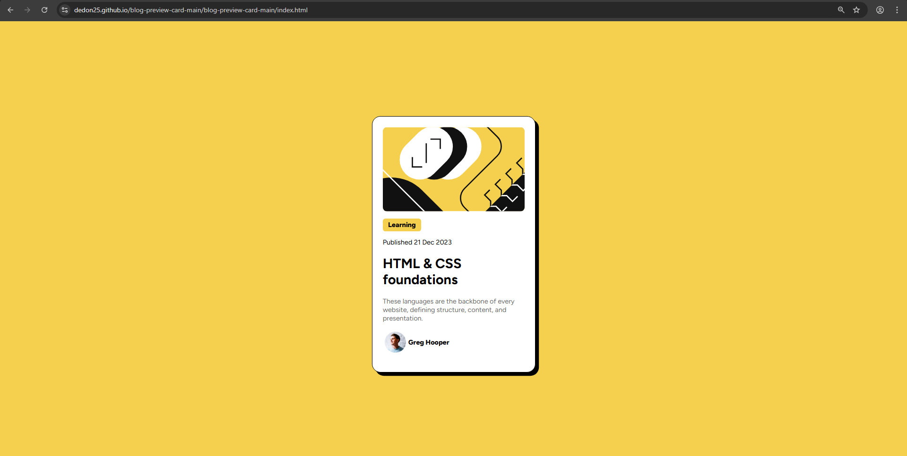

# Frontend Mentor - Blog preview card

# 📘 Blog Preview Card

This is a solution to the **Blog Preview Card** challenge from Frontend Mentor. The project focuses on building a responsive card component using HTML and CSS.

## 🚀 Overview

The Blog Preview Card is a simple UI component that displays a blog post summary, including:

- Featured image  
- Category tag  
- Publish date  
- Title  
- Description  
- Author information  

It is designed to be responsive and visually appealing across different screen sizes.

## 🛠️ Built With

- HTML5  
- CSS3 (Flexbox)  
- Custom font using `@font-face`

## 🎯 Features

- Responsive layout using Flexbox  
- Clean and modern UI  
- Custom typography (Figtree font)  
- Styled card with shadow and rounded corners  
- Accessible image alt descriptions  

## 📂 Project Structure
├── index.html
├── assets/
│ ├── images/
│ │ ├── illustration-article.svg
│ │ └── image-avatar.webp
│ └── fonts/
│ └── Figtree-VariableFont_wght.ttf

## 💡 What I Learned

- How to structure a reusable card component  
- Using Flexbox for layout alignment  
- Applying custom fonts with `@font-face`  
- Creating consistent spacing and styling  

## 📸 Screenshot

## 🔗 Live Demo

You can view the live project here:  
👉 *Add your deployment link here (e.g., GitHub Pages)*

## 🧠 Future Improvements

- Add hover effects for interactivity  
- Improve accessibility (ARIA roles, semantic HTML)  
- Convert to a reusable component (e.g., React)  

## 👤 Author

- Your Name  
- Frontend Mentor Profile *(optional)*  
- GitHub Profile *(optional)*  
